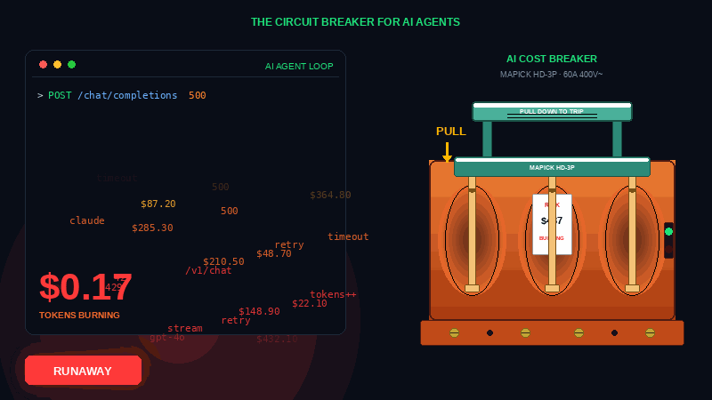
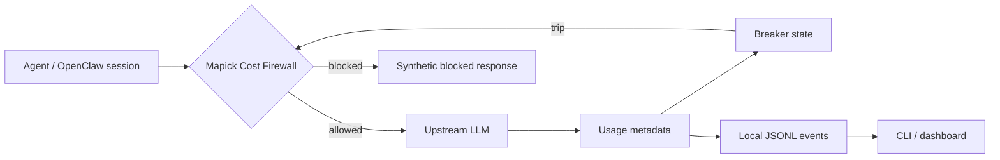

<!--
Repo description suggestion:
Local kill switch and circuit breaker for runaway AI agents. OpenClaw plugin for LLM cost monitoring, token storm detection, budget limits, dashboard control, and emergency stop.

GitHub topics suggestion:
ai-cost llm-cost llm-observability llm-gateway ai-gateway ai-agents circuit-breaker
openclaw openai anthropic openrouter cost-monitoring budget-control rate-limit kill-switch
-->

<div align="center">

# Mapick Cost Firewall

### The big red switch for runaway AI agents.

**Local LLM cost monitoring, automatic breaker rules, dashboard control, and one-command emergency stop for OpenClaw.  
Catch retry loops, token storms, and surprise AI bills before they become screenshots.**

[](https://github.com/mapick-ai/cost-firewall/releases)
[](https://www.npmjs.com/package/@mapick/cost-firewall)
[](./LICENSE)
[](#development)
[](#try-it)
[](#verified-on-real-openclaw)

<br />



<br /><br />

**[Try it](#try-it)** · **[Dashboard](#dashboard)** · **[Kill switch](#kill-switch)** · **[What it stops](#what-it-stops)** · **[Commands](#commands)** · **[Privacy](#privacy)** · **[Where it fits](#where-it-fits)**

</div>

---

## Why This Exists

AI agents are wonderful until one gets stuck in a retry loop at 3 AM.

Provider dashboards tell you what happened after the bill lands. Mapick Cost Firewall acts earlier: it watches local call metadata, detects runaway behavior, and trips a breaker before one broken source keeps spending.

Think of it as a handbrake for agent infrastructure:

```bash
openclaw firewall stop
```

One command. Every AI call paused. Breathe first, debug second.

## Try It

Verified on a real OpenClaw instance with `v0.2.9`.

```bash
curl -fsSL https://raw.githubusercontent.com/mapick-ai/cost-firewall/v0.2.11/install.sh | bash
openclaw firewall status
```

Manual install:

```bash
openclaw plugins install @mapick/cost-firewall
openclaw plugins enable mapick-firewall
openclaw gateway restart
openclaw firewall status
```

Recommended first run:

```bash
openclaw firewall mode observe
openclaw firewall log --last 20
```

Start in `observe` mode, watch what would have happened, then switch to `protect` once the thresholds match your workload.

```bash
openclaw firewall mode protect
```

## Dashboard

After install, open:

```text
http://localhost:18789/mapick/dashboard
```

The dashboard is local to your OpenClaw gateway and shows:

- today's token spend
- blocked count and saved estimate
- emergency stop state
- breaker thresholds
- cooling sources
- active runs
- recent firewall events

The same emergency brake is available from the dashboard and the CLI.

## Kill Switch

When an agent starts spending faster than you can read logs:

```bash
openclaw firewall stop
```

Confirm it:

```bash
openclaw firewall status
```

You should see:

```json
{
  "emergency_stop": true
}
```

When you are ready to resume:

```bash
openclaw firewall resume
```

## What It Stops

| Failure mode   | What Mapick watches                 | Default behavior                  |
| -------------- | ----------------------------------- | --------------------------------- |
| Retry loop     | Same source fails repeatedly        | Trip after 3 consecutive failures |
| Token storm    | Tokens used inside a sliding window | Trip at 100K tokens / 60s         |
| Call flood     | Calls made inside a sliding window  | Trip at 30 calls / 60s            |
| Budget runaway | Daily token total crosses your cap  | Block globally until reset        |
| Panic moment   | You hit emergency stop              | Block all AI calls immediately    |

Sources are tracked independently where OpenClaw provides enough context. One noisy agent should not take every other agent down with it.

## Commands

| Command                               | Action                                                          |
| ------------------------------------- | --------------------------------------------------------------- |
| `openclaw firewall status`            | Show mode, token count, blocked count, limits, cooldown sources |
| `openclaw firewall stop`              | Emergency stop: pause all AI calls                              |
| `openclaw firewall resume`            | Resume after emergency stop                                     |
| `openclaw firewall mode observe`      | Record only, do not block                                       |
| `openclaw firewall mode protect`      | Enable breaker rules                                            |
| `openclaw firewall budget set 500000` | Set a daily token cap                                           |
| `openclaw firewall budget reset`      | Remove the daily token cap                                      |
| `openclaw firewall log --last 20`     | Show recent firewall events                                     |
| `openclaw firewall reset <source>`    | Clear cooldown for one source                                   |

OpenClaw chat command registration uses the same vocabulary: `/firewall status`, `/firewall stop`, `/firewall resume`, `/firewall log`.

## Configuration

```jsonc
{
  "plugins": {
    "entries": {
      "mapick-firewall": {
        "enabled": true,
        "config": {
          "dailyTokenLimit": null,
          "breaker": {
            "consecutiveFailures": 3,
            "cooldownSec": 30,
            "tokenVelocityThreshold": 100000,
            "tokenVelocityWindowSec": 60,
            "callFrequencyThreshold": 30,
            "callFrequencyWindowSec": 60,
          },
        },
      },
    },
  },
}
```

Defaults are meant to catch obvious loops. Raise thresholds for busy agent workloads; lower the daily cap for hobby projects or demos.

## How It Works



Mapick does not need prompt text to trip breakers. The useful signals are metadata:

- source identifier
- provider and model
- outcome and error category
- estimated token usage
- timestamps and cooldown state

## Privacy

| Question                              | Answer                       |
| ------------------------------------- | ---------------------------- |
| Does it need a Mapick account?        | No                           |
| Does it send telemetry to Mapick?     | No                           |
| Does it store prompt text by default? | No                           |
| Where are events stored?              | Local OpenClaw plugin state  |
| Can I audit it?                       | Yes, MIT licensed TypeScript |

The default privacy setting is `storePromptText: false`.

## Verified On Real OpenClaw

`v0.2.9` was tested on a real OpenClaw gateway:

| Check             | Result                                                  |
| ----------------- | ------------------------------------------------------- |
| Package installed | `@mapick/cost-firewall@0.2.9`                           |
| Gateway status    | running                                                 |
| API route         | `/mapick/api/stats` returns `application/json`          |
| Dashboard route   | `/mapick/dashboard` returns Mapick Firewall HTML        |
| CLI status        | returns `version: 0.2.9`                                |
| Emergency stop    | `openclaw firewall stop` sets `emergency_stop: true`    |
| Resume            | `openclaw firewall resume` sets `emergency_stop: false` |
| Test suite        | 9 files, 47 tests passing                               |

If you previously installed early builds, you may see a duplicate plugin warning from an old legacy path. The active plugin should point to:

```text
~/.openclaw/npm/node_modules/@mapick/cost-firewall/dist/index.js
```

and report:

```json
{
  "version": "0.2.9"
}
```

## Where It Fits

Mapick is not trying to replace a full AI gateway or observability platform.

| Tool category      | Examples                                                                                                | Use them for                                               | Use Mapick for                                       |
| ------------------ | ------------------------------------------------------------------------------------------------------- | ---------------------------------------------------------- | ---------------------------------------------------- |
| AI gateway         | [LiteLLM](https://github.com/BerriAI/litellm), [Portkey Gateway](https://github.com/Portkey-AI/gateway) | multi-provider routing, load balancing, central API access | local emergency brake and cost circuit breaker       |
| Observability      | [Helicone](https://github.com/Helicone/helicone), [Langfuse](https://github.com/langfuse/langfuse)      | traces, analytics, experiments, dashboards                 | stopping a runaway local agent immediately           |
| Provider dashboard | OpenAI, OpenRouter, Anthropic                                                                           | billing history and provider-side usage                    | local pre-bill intervention                          |
| DIY scripts        | shell, cron, custom rate limits                                                                         | one-off control                                            | packaged rules, CLI, dashboard, OpenClaw integration |

The shortest positioning: **gateways route, dashboards explain, Mapick brakes.**

## Troubleshooting

If `openclaw firewall status` fails, check that the API is mounted:

```bash
curl -i http://127.0.0.1:18789/mapick/api/stats
```

Expected:

```text
Content-Type: application/json
```

If you see OpenClaw Control HTML instead, restart the gateway:

```bash
openclaw gateway restart
openclaw firewall status
```

If you installed older beta builds and see a duplicate plugin warning, remove or ignore the old legacy extension path after confirming the active plugin is `0.2.9`.

## Development

```bash
npm install
npm run build
npm test
```

## License

MIT
